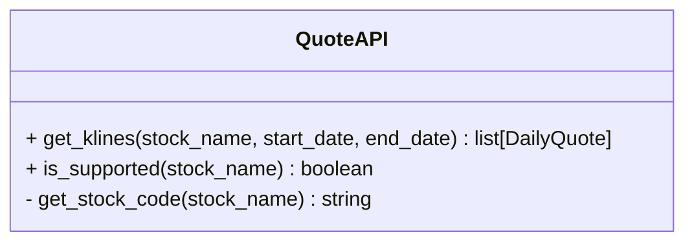

# 文件结构
├─ database 数据库文件目录
├─ docs 文档
├─ financial_reports 财报相关处理
├─ utils 基础模块
│   ├─sqlite.py  数据库读写抽象
│   └─logger.py  日志读写工具
│
├─ quantitative 量化分析模块
│   ├─indicator  指标/形态相关逻辑
│   │   ├─indicator_base.py 指标基类
│   │   ├─macd.py
│   │   ├─rsi.py
│   │   └─...
│   ├─ml 机器学习模块
│   └─analysis  分析报告模块
│
├─ quote_api 数据获取api
│   ├─ futu
│   └─...
│
├─ data_retrieval 拉取数据填充数据库的模块
│
│
│
├─ tests 测试模块
├─ tools 一些小工具
└─ logs 运行日志，

# 模块功能

## quote_api
这是拉取数据数据的接口，可以通过不同的途径拉取股票数据，例如腾讯采集，futu OpenID等，基类为：

